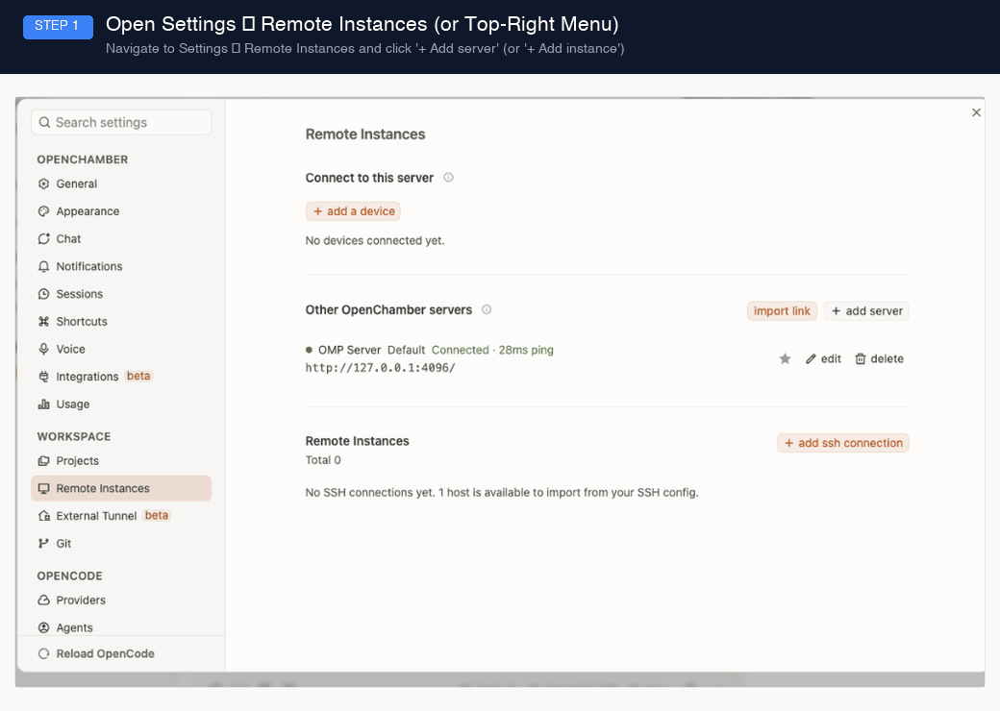

# omp-openchamber-server

Use [OpenChamber](https://github.com/OpenChamber/OpenChamber) as a UI for [oh-my-pi](https://github.com/can1357/oh-my-pi) coding sessions — without modifying either project.

## Quick Start

### 1. Prerequisites

- [`omp`](https://github.com/can1357/oh-my-pi) on `PATH`
- [OpenChamber](https://github.com/OpenChamber/OpenChamber) installed or running
- [Bun](https://bun.sh) runtime

### 2. Start the Proxy Server

```bash
bun install
bun run start
# → [proxy] listening on http://127.0.0.1:4096
```

### 3. Connect to OpenChamber



#### Option A: Via OpenChamber UI (Recommended)

1. Open OpenChamber and go to **Settings** → **Remote Instances** (or click the instance switcher in the top bar and select **+ Add instance**).
2. Click **+ Add server** and fill in the details:
   - **Label (optional)**: `OMP Server`
   - **URL**: `http://127.0.0.1:4096`
   - **Connection token**: *(leave blank for local servers)*
   - Click **Add server**.
3. Verify the status indicator turns green (`● Connected`). Star or select **OMP Server** as your active instance. All existing oh-my-pi sessions will appear in the sidebar!

#### Option B: Via CLI Environment Variables

```bash
OPENCODE_HOST=http://127.0.0.1:4096 \
  OPENCODE_SKIP_START=true \
  openchamber serve --foreground --port 3000
```
Open `http://127.0.0.1:3000/` in your browser.

### Verify

```bash
# Proxy health
curl http://127.0.0.1:4096/global/health
# → {"healthy":true,"status":"ok"}

# Session list
curl "http://127.0.0.1:4096/session?directory=<your-project-dir>"

# Type-check
bun run check

# Default suite (mock OMP; Tier C live tests auto-skip)
bun test

# Live suite (real `omp` binary + reachable provider; minutes of wall time)
bun run test:live
```

### Test tiers

- **Tier A/B** (`bun test`): contract, sequence, sessions, and HTTP integration tests driven by `test/mock-omp.mjs` (a deterministic stand-in speaking the real OMP RPC dialect). Always green; no network, no provider.
- **Tier C** (`bun run test:live` → `src/integration.live.test.ts`): end-to-end against the real `omp` binary. Auto-skips when the `omp` binary or a reachable provider is missing, so the default `bun test` costs zero. Requires: `omp` on `PATH` and a reachable model provider in `~/.omp/agent/models.yml`. It creates a scratch session, runs real turns, and asserts the exact OpenCode event vocabulary, message persistence shapes, busy-lock `409`, and abort semantics.

## Design

OpenChamber is built as a frontend for [OpenCode](https://github.com/OpenCode/OpenCode). oh-my-pi speaks its own RPC protocol. This proxy sits between them, impersonating the OpenCode HTTP API that OpenChamber expects while driving omp's RPC underneath.

```
OpenChamber ──(OpenCode HTTP API)──▶ proxy ──(omp RPC)──▶ oh-my-pi coding agent
```

The proxy translates three paths:

| OpenChamber call               | Backed by omp RPC               |
| ------------------------------ | ------------------------------- |
| `GET /session`                 | `~/.omp/agent/sessions` scan    |
| `GET /session/:id/message`     | session JSONL read (fast path); `switch_session` + `get_messages` RPC as fallback |
| `POST /session/:id/prompt_async` | `prompt` / `set_model` / streaming events |
| `GET /config/providers`        | `get_available_models`          |
| `POST /session/:id/abort`      | `abort`                         |

Key invariants:

- Zero changes to OpenChamber or oh-my-pi.
- Session IDs are deterministically encoded (`omp UUID` → `ses_<32hex>`), so URLs survive proxy restarts.
- Message records carry `parentID` and `finish: "stop"` so OpenChamber's turn grouping and sorted render work correctly.
- Tool calls (`read`, `bash`, `grep`, …) are mapped to real `type:"tool"` parts with `state.status/input/output/time`, not just text dumps.
- Live prompts stream via `message.part.delta / message.part.updated / session.status` SSE events that match OpenChamber's reducer contract.

Embedded-OMP resilience (`src/rpc.ts`): the spawned OMP instance is hardened so a flaky environment cannot wedge the proxy —

- Readiness is gated on the **first real RPC response** (`get_state` probe) rather than the `ready` frame; OMP processes stdin frames before it emits `ready`, but the frame can be withheld by subsystems (MCP servers, update checks) that stall. 30 s per attempt, up to 3 spawn attempts.
- A per-run `--config` overlay (`mcp.enableProjectConfig: false`) disables the project MCP servers for the embedded instance only. The sidecar's own `/mcp` returns `[]`, so those servers are pure overhead here, and a deadlocking one (observed: `typescript_lsp`, up to 11 minutes) otherwise delays every request. The user's global OMP config is untouched.
- The child runs in its own process group; failures and shutdown kill the whole tree (MCP/LSP grandchildren included), so nothing lingers.
- `PI_SKIP_VERSION_CHECK=1` removes the update-check network call from startup.

## Documentation

Comprehensive design specifications and protocol analyses are available in [`docs/`](./docs):

- [`architecture.md`](./docs/architecture.md) — Subsystem architecture, process management, JSONL fast path, and core invariants.
- [`api-reference.md`](./docs/api-reference.md) — Complete OpenCode HTTP and SSE endpoint reference with request/response schemas.
- [`omp-protocol.md`](./docs/omp-protocol.md) — oh-my-pi stdio NDJSON RPC protocol, commands, turn events, and disk schemas.
- [`openchamber-contract.md`](./docs/openchamber-contract.md) — OpenChamber SSE stream lifecycle, message/part schemas, and UI reducer contracts.
